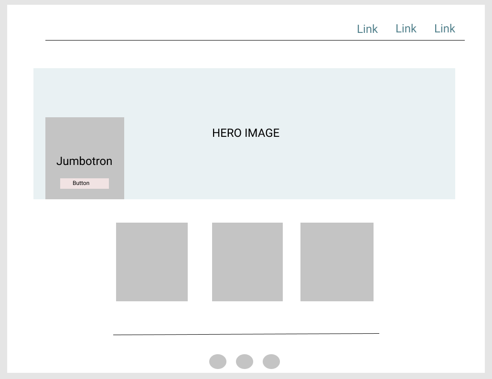

<h2 align = "center">Our Recipe</h2>

<p align ="center">An online communal cookbook<br>
This website was designed so anyone can browse through tasty recipes as well as submit and share their own tasy recipe.
Purposefully done to be clean and simple; users can navigate very easily so they can either try someone else's recipe or share theirs to others.
</p>

## Table of Contents

[**Demo**](#demo)

[**UX**](#ux)

[**Technologies Used**](#technologies-used)

[**Information Architecture**](#information-architecture)

[**Testing**](#testing)

[**Bugs and Fixes**](#bugs-and-fixes)

[**Deployment**](#deployment)

[**Credits**](#credits)

## Demo

<a href= "https://our-recipe.herokuapp.com/" target= "_blank">Live Demo</a>


[**back to top**](#table-of-contents)
## UX

### Goals

The goal of this website is to create a user submitted library of recipes that is unique and with a "non-commercial" feel. Clean and simple, users should feel like they are cooking 
recipes from their grandparents, parents, friends and people close to them. 

### Target audience goals

This website is catered for people who love to cook recipes with a "local" feel regardless of age and gender.

User needs:
- Selection of unique, non-commercial and user submitted recipes.
- Be able to share their own recipe.
- Simple and clean design.
- Free from ads, blogs and other "clutter".
- Easy to navigate on any device.

How this website meets their needs:
- Users are able to submit their own recipe.
- Growing collection of user submitted recipes to choose from.
- Design is simple and clean but still visually appealing.
- No blogs , unnecessary clutter or ads.
- The design like the fixed Navbar makes its very easy to navigate around.

### Goals as a developer

- Expand my portfolio.
- Practice my Python ,Database and Framework skills as well as refresh my HTML,CSS and JS skills.
- A communal online cookbook with a collection of unique and user submitted recipes.
- Increase users which will also grow the number of recipes available.

### User stories

As a user, what I would want in a recipe website:
1. Direct and easy way to get to the recipe I want.
2. A number of recipes to choose from.
3. Submit and contribute my own recipes.
4. For recipes to have that "home-made" feel.
5. Access the website from any device.

### Research

I visited a number of recipes website for inspiration and to discover what works and what doesnt. I personally find it irritating that when I pick a recipe, 
I have to scroll past blogs and photos before getting to the information Im after. I also found that most recipes have a restaurant and commercial feel 
to it.

### Design choices

**Colour scheme**
- The initial colour design (refer to [**Wireframe**](#wireframes)) leaned towards a feminine feel so the colours were changed.
- The primary colours for this website are #fff , #51808B and different shades of grey. The colours are chosen because they are gender neutral 
so it caters to all users regardless of gender.
- The colour combination also presents a clean and simple looking website because the colours are not too "strong".

**Fonts**
- Intially, I used Pacifico:cursive for the header font. I decided to change the font as this was not reflective of my design goals.
- I'm using Poppins as my main font as this presents a much simpler and cleaner feel which is one of my design goals.

**Ease of use**
- Navbar is fixed at the top so users will always have access to the main/important pages.

**Recipes Page**
- Initial design was to display the available recipes (name and cooking time) in a accordion. The design was updated to cards as
the accordion design simply did not allow me to provide enough information for the users browsing through the recipes page.
- Cards are nows used to display the available recipes as this allows me to display a lot more information to the user such as images, short description, prep time and etc.
- Cards also provide a cleaner and less cluttered look which reflects the "clean" look goal.
- Search bar added so users can quickly search recipes.

**Footer**
- Footer was added to the final design. The footer section allows me to put navlinks at the bottom of the page which will increase ease of use for users.

### Wireframes

Figma was used to create my mock ups.

**Initial Mock up Home**


**Mock up add recipe page**


**Revised Mock up Home**



[**back to top**](#table-of-contents)

## Features

- [x] Users are able to add their own recipes.
- [x] Users are able to edit and update recipes.
- [x] Search bar for recipes where users can search any keyword related to the recipe that they want.
- [x] Time stamps for updated and added recipes.
- [x] Newest recipe will be the first on the recipe list.
- [x] Quick access to newest and most viewed recipes on home page.
- [x] Ability to add recipes in Favourites using users local storage.
- [x] Recipes already in Favourites will alert the user that recipe is already in favourites and will prevent them from adding a duplicate.
- [x] Fixed Navbar so users can always find their way around.
- [x] Form validation.
- [x] Users can subscribe with their email. 
- [x] Collapsible navbar on mobile view.
- [x] Jumbotron with "Hello" animated in different languages.
- [x] Footer with access to navlinks and social links.
- [x] Recipe library displayed in cards with images.

## Features to add

- [ ] User registry and login.
- [ ] Users are only able to update and delete recipes if it was submitted by them.
- [ ] The option to filter recipes by category, cooktime, preptime and etc.
- [ ] Pagination for when the library grows.
- [ ] Weekly automated emails for subsribers.
- [ ] Ability to rate the recipes and users to comment.
- [ ] More information such as servings, calories , nutrition value and etc.
- [ ] Admin access to delete, edit and update recipes.
- [ ] Admin ability to review recipes before website displays it.
- [ ] The ability to upload a photo file instead of a url.
- [ ] Auto-sizer and optimizer for photos.
- [ ] Improve Search feature.

[**back to top**](#table-of-contents)

## Information Architecture
I used MongoDB Atlas to store and retrieve data for this website.

**To store Categories**
```
_id: ObjectID
category_name: String
```
**To store Recipes**
```
_id:ObjectID
recipe_name: String
category_name: String
recipe_description: String
ingredients:String
methods: String
prep_time: String
cooking_time: String
url_image: String
added_on: String (note: This will be replaced by "last_update:" once recipe is updated)
fave: String
```
**To store Subscribers**
```
_id:ObjectID
email: String
```

[**back to top**](#table-of-contents)

## Technologies used

**HTML** - To create the foundation and structure of my website. <br>
**CSS** - To add styles and make my website visually appealing.<br>
**Figma** - To create the wireframe of my website.<br>
**Javascript** - To expand the capability and interactivity of my website.<br>
**Python** - The core language used in this project.<br>
**Flask, Jinja, Pymongo** - Frameworks used for this project to help tie everything together.<br>
**Bootstrap CDN** - Components from BS library heavily used in this website.<br>
**MongoDB/Atlas** - To store and grab user submitted data for my website.<br>
**GitHub**- To store and share this project.<br>
**Heroku** - To deploy my website.<br>
**Font Awesome**- To access the icons that I wanted for this website.<br>
**Gitpod**- To write my code using their IDE.<br>

## Testing 

### Validated through:

- [W3C Markup Validation]( https://validator.w3.org/) for HTML.
- [W3C CSS validation](https://jigsaw.w3.org/css-validator/) for CSS.
- [JSHint](https://jshint.com/) for JavaScript.
- [Autoprefixer CSS]( https://autoprefixer.github.io/) for browser compatibility.

### Tested through 

- Google Lighthouse
- [Mobile Friendly Test - Result](https://search.google.com/test/mobile-friendly?id=9Plrf2ZSoX8vpdkyxBGLeA)
- Chrome developer tools
- [BrowserStack](https://www.browserstack.com/)

**Testing was done by me and 6 users**

The following scenarios were tested:

1. **Submit recipe & Update function**
- Multiple recipes were added and updated. Recipes checked to see if it was accurately added or updated. 
- Checked to see any console log errors when adding and updating recipes.
- Confirmed that the added recipe shows in "Recently Added" on the Home page and also shows up in the Recipe page. 
- Confirmed that time stamps accurately records date added and date updated.
2. **Layout and design**
- Tested on multiple browsers and different devices.
- Tested responsiveness by putting it through responsivedesignchecker.com. (See [**Bugs**](#bugs-and-fixes) section )
3. **Forms**
- Tried to submit a recipe without filling the forms which website will not allow. A prompt will tell users that forms need to be filled out.
- Tried filling Image URL text area with non-url text which triggers the form validator.
- The update forms are pre-filled as intented.
- Update forms also will not let users submit unless all forms are filled correctly.
- Subscribe form will not accept submission unless its in email format.
4. **Favourites**
- All recipes added to Favourites page are successfully displayed on the Favourites page.
- Tried to add a recipe thats already in Favourites to Favourites which the website will not allow and is working as intended.
5. **Newly added items**
- Newly added recipes also appear first on the Recipes page as intended.
6. **Time stamps**
- Added recipes correctly displayed the date it was added.
- Updated recipes correctly displayed the date it was updated.
- Updated a recipe and it correctly replaced "Added on" to "Last updated" as intented.
7. **Links**
- All links were tested and all links correctly redirects to the intended page.
- Social links redirect to the correct social.
8. **Buttons**
- All buttons work and execute their assigned functions.
9. **Search function**
- Performed multiple searches using keywords and recipes associated to those keywords are displayed successfully. See [**Bugs**](#bugs-and-fixes) section )
- If no results are found,the website successfully returns the "No results" feedback.
10. **404 & 500**
- 404 and 500 error simulated using "abort" and website successfully returns the intended feedback.

## Further testing 
This website is subjected to further and ongoing testing as new features are added.

## Bugs and Fixes

1. **Added on time stamp**
- Initially, the "Added on" feature would over write and delete all other key values except for the "Added on" key and value. 
Fixed: This was remedied by adding the below code before inserting the time stamp directly.

```python
    added_on = now.strftime('%d %B %Y')
    recipe['added_on'] = added_on
```
2. **Flash feedback on Subscribe**
- Initially, when a user subcribes with their email, the website will throw an error. 
Fixed: This was solved by adding a 'SECRET_KEY' to Heroku.
3. **Search**
- When searching keywords, sometimes the search returns are barely related to my keyword. 
Status: I would like to optimise this in the future by probably using a 3rd party search engine. 
4. **Layout and responsiveness**
- The website is not fully optimised (some grids over lap) to work on older devices such as iPhone 4 - 6. 
Status: Due to those devices being uncommon these days and due to time constraints, I have decided to leave this as it is.
5. **Some images look pixelated**
- Due to the lack of control on the size and quality of images submitted, some photos may look pixelated/ stretched.
Status: I would like to implement a feature wher users are able to upload a file rather than a URL. I would also like to set a size for uniformity.
Due to the complexity of this feature, this bugs remains for now.

[**back to top**](#table-of-contents)

## Deployment ##

This project was built using Gitpod IDE , commited and published using GitHub.

### To run this project locally ###
Note: You will need to create a free  <a href ="https://account.mongodb.com/account/register?n=%2Fv2%2F5f3e6174de92e37945456693&nextHash=%23metrics%2FreplicaSet%2F5f3e627682daf72308004a81%2Fexplorer%2Four_recipe%2Fsubscribers%2Ffind">MongoDB</a> account and create your own collection. 
1. Follow this <a href="https://github.com/haleanana/our-recipe" target = "_blank"> link </a>
2. Click "Clone or Download". 
3. Copy the clone URL under the HTTPs section.
4. Run the files in your local IDE.
5. Upgrade PIP with 
```
$ pip install -U pip
```
6. Install dependancies using 
```
$ pip3 install -r requirements.txt
```
7.  Create a env.py file with the data that matches my code. Place your own values.
```
import os
os.environ['MONGO_DB'] = 
os.environ['MONGO_URI'] = 
os.environ['SECRET_KEY'] = 
```
Note: Please do not forget to add env.py to your .gitignore file.

### Heroku deployment
Heroku was used to deploy this project with the following steps.
1. Logged in to Heroku.
2. Created a new file called "our-recipe" and picked the region closes to me.
3. Under the Deploy section , I connected to Github and also connected to the repo associated.
4. Under the Settings section, I updated the "Config Vars" to match my code 

Config Vars | Config Vars
------------ | -------------
IP | 0.0.0.0
PORT | 5000
SECRET_KEY | (hidden)
MONGO_URI | (hidden )
5. In my IDE, I entered my Heroku credentials and typed:
```
$ git push heroku master
```
6. Back to Heroku, I selected "Enable Automatic Deployment"
7. Selected "Master" as branch.
8. Wait for Heroku to finish and then click "Open app".

[**back to top**](#table-of-contents)

## Credits

**Fontawesome**
- Icons used for social links. 

**Unsplash**
- Photo by <a href="https://unsplash.com/@brookelark?utm_source=unsplash&amp;utm_medium=referral&amp;utm_content=creditCopyText">Brooke Lark</a> on <a href="https://unsplash.com/@brookelark?utm_source=unsplash&amp;utm_medium=referral&amp;utm_content=creditCopyText">Unsplash</a>

**Stack Overflow**
- For fixes and references that helped me create this website.

**Photopea**
- Used to edit images found through this website.

**W3schools**
- Used for references and as a refresher.

**Code Institute Mini Task Manager**
- Used as a reference and guide.

**Mentor - Femi Medale**
- For helping me with my search function and over all design of my website.

### Special mentions:

- My team of testers which include Estefi, Hines , Craig and Keitel who is always there to help me test my projects and help spot erros and bugs.

### Disclaimer: 

This entire website is used for educational purpose only.

[**back to top**](#table-of-contents)
